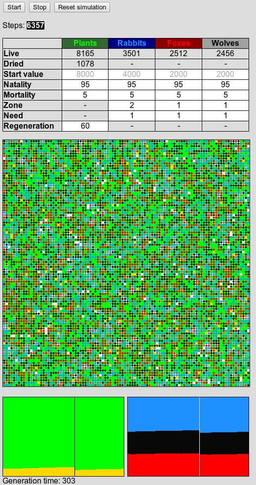

# Cruel Predator & Prey Simulation
It is a simple simulation script on the theme predator & prey, with a reduced nutrition chain and a simplified rivalty between species.
## Main actors:
* plants _(rabbit food)_
* rabbits _(wolf and fox food)_
* foxes 
* wolves

## Actor activities:
* **dried plants:** revives or dies
* **plants:** dries or rebirths or survives and eventually reproduces
* **rabbits:** dies or eats and eventually reproduces
* **wolves:** dies or eats and eventually reproduces
* **foxes:** dies or eats and eventually reproduces

## Obligatory screenshot of the gui:

The **gray color data** is only used when simulation is reset.
The **black color data** on white cells are validated immediately.

_Note: the generation time can be considerably longer on iceweasel for some unknown reason. If you know a solution, give me a clue._
## Challenges:
You can challenge yourself with funny objectives:
* preserve all species during 20000 turns (steps)
* protect the rabbits
* let the foxes survive
* etc.

_Note: Please don't make harm to these animals, they are so innocent._
